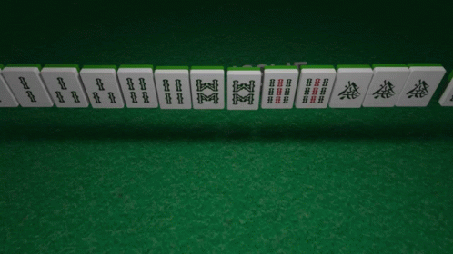

# mahjong-counter

`mahjong-counter` lets you easily keep track of the score of all 4 players in your Mahjong games

Seamlessly add and remove points as different players win each round!

### Why?

I wanted a tool that streamlined your games of Mahjong to focus less on the score and more on playing the game!

