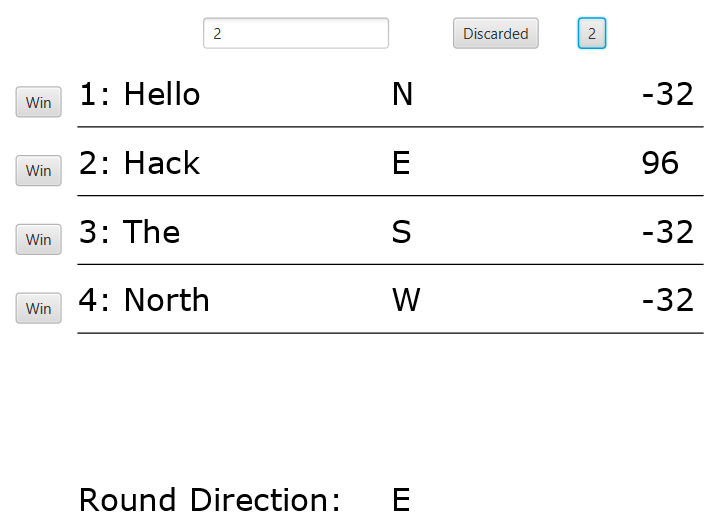

# mahjong-counter

`mahjong-counter` lets you easily keep track of the score of all 4 players in your Mahjong games

### Why?

I wanted a tool that streamlined your games of Mahjong to focus less on the score and more on playing the game! 

The inspiration for this project came when my family started playing Mahjong during the pandemic. I noticed that my dad was taking too long manually calculating the point totals after each round, which slowed down our games. This challenge motivated me to create an automated point counter to streamline the process and enhance our gaming experience. What began as a solution to a practical problem quickly became a passion project, leading me to explore the complexities of Mahjong and improving our family game nights.

#

#

#

#

Seamlessly add and remove points as different players win each round!
